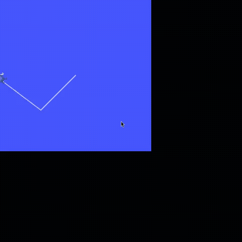

# `use_ros` live showcase

A reproducible, one-command demonstration of the `use_ros` tool driving a
**real ROS 2 `turtlesim` node** entirely in-process through `rclpy` - no `ros2`
CLI, no code-generation. It exercises every action and captures real data,
including a closed **sense -> act -> sense** loop and the structured-error
contracts.

## A Strands agent driving the turtle (natural language -> a clean square)

`agent_drive.py` hands the `use_ros` tool to a Bedrock-backed Strands agent
(`global.anthropic.claude-opus-4-8`) and asks it, in plain English, to drive a
**square using closed-loop control**. The agent echoes the pose after every
move, computes the heading error, and issues corrective turns until each corner
is within tolerance - 43 `use_ros` calls in all, every one in-process through
rclpy (no `ros2` CLI).



```
start pose: (3.0, 3.0, 0.0)
=== AGENT DRIVING A CLOSED-LOOP SQUARE ===   [global.anthropic.claude-opus-4-8 via Amazon Bedrock]
  Corner 1: (5.35, 3.00)  theta~1.569     Corner 2: (5.36, 5.52)  theta~+-3.14
  Corner 3: (2.84, 5.49)  theta~-1.547    Corner 4: (2.90, 2.97)  theta~0.013
"All headings landed within ~0.05 rad of the cardinal targets via closed-loop
 echo+correct, and the path closed cleanly back to the origin."
final pose: (2.897, 2.972, 0.013)   <- back at the start corner
```

The script first resets the canvas and teleports the turtle to a known corner -
both via `use_ros` `service_call` (note `teleport_absolute` is resolved
dynamically and is not in any static type registry). Full transcript in
[`agent_sample_output.txt`](./agent_sample_output.txt); the recording above is
the live turtlesim canvas (static thinking-pauses between tool calls removed, so only the turtle's motion remains).

```bash
# inside a sourced ROS 2 env with turtlesim running:
export AWS_BEARER_TOKEN_BEDROCK=...   # or any boto3 credential chain
pip install strands-agents
bash run_agent.sh        # starts turtlesim + runs the agent
# or directly: python3 agent_drive.py
```

## Run it

```bash
cd examples/ros2/use_ros
docker compose run --build --rm showcase
```

Builds `ros:jazzy` + `turtlesim` + `strands-agents`, starts a real turtlesim
node, and runs `showcase.py` against it. Exits `0` iff the turtle moved.

## What it proves

| Action | What the live run shows |
|--------|-------------------------|
| `status` | `backend: rclpy (in-process)` |
| `list_topics` / `list_nodes` / `list_services` | the real graph - including our own `/strands_robots_use_ros` node |
| `info` | live type + publisher/subscriber counts for `/turtle1/cmd_vel` |
| `echo` | real `turtlesim/msg/Pose` samples as JSON |
| `publish` | a `geometry_msgs/msg/Twist` that **moves the turtle** (velocities latch to the exact values sent) |
| `service_call` | `/spawn` returns `{"name": "t2"}`, and `t2`'s topics then appear in `list_topics` |
| error: bad type | `nonexistent_pkg/msg/Foo` -> `{"status": "error"}` (`No module named 'nonexistent_pkg'`), never a crash |
| error: bad name | `/bad; rm -rf` rejected by input validation |

The headline: a closed loop driven purely by `use_ros` -

```
before: (x=5.544, y=5.544, theta=0.000)
publish Twist {linear.x=2.0, angular.z=1.8} x20
after:  (x=4.428, y=6.500, theta=-1.445)   linear_velocity=2.0  angular_velocity=1.8
```

A captured run is saved in [`sample_output.txt`](./sample_output.txt).

## Files

| File | Role |
|------|------|
| `showcase.py` | Exercises every `use_ros` action; asserts the turtle moved. |
| `run_showcase.sh` | Starts a headless turtlesim, then runs `showcase.py`. |
| `Dockerfile` | `ros:jazzy` (provides rclpy) + turtlesim + `strands-agents`. |
| `docker-compose.yml` | One-command build + run. |
| `sample_output.txt` | A captured live run for reference. |

## Notes

- `use_ros` needs `rclpy` importable, which means a **sourced ROS 2 distro**
  (rclpy / `rosidl_runtime_py` are not on PyPI). The `ros:jazzy` base image
  provides it; only `strands-agents` is pip-installed. To run outside Docker,
  `source /opt/ros/<distro>/setup.bash` first.
- Already on a ROS 2 machine? Just run `showcase.py` with turtlesim up - no
  container needed.
