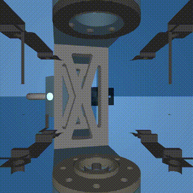

# VERA PushT — MuJoCo rollout

End-to-end smoke test for the [`vera`](../../strands_robots/policies/vera/) policy
provider: a planar pusher in a strands-robots `Simulation` driven by the **real**
VERA PushT policy (DFoT video planner + Jacobian inverse-dynamics model), served
from the `strands-vera-server` container over WebSocket.



*The DFoT planner dreams the next frames; the Jacobian IDM turns them into a 2-D
push-velocity chunk; strands-robots applies it to the pusher. ~2 s/chunk on an L40S.*

## Run

```bash
# 1. checkpoints (once)
hf download sizhe-lester-li/VERA --local-dir ./vera-ckpts

# 2. server (holds the GPU; serves ws on :8820)
docker build -f strands_robots/policies/vera/docker/Dockerfile -t strands-vera-server:latest .
docker run --rm --gpus all --ipc=host -p 8820:8820 \
    -v "$PWD/vera-ckpts":/ckpts:ro -e VERA_EMBODIMENT=pusht \
    strands-vera-server:latest

# 3. rollout (host venv; needs only sim-mujoco + the ws client)
uv pip install -e '.[sim-mujoco]' websockets msgpack
MUJOCO_GL=egl python examples/vera_pusht_mujoco/rollout.py \
    --record examples/vera_pusht_mujoco/artifacts/pusht_rollout.mp4
```

Or let the provider manage the container (no manual `docker run`):

```bash
python examples/vera_pusht_mujoco/rollout.py \
    --server-mode docker --ckpt-root "$PWD/vera-ckpts"
```

## Notes

- PushT is a **task-space** 2-D push. VERA's PushT policy emits a 2-D velocity
  chunk (`action_dim=2`, no gripper); this example maps it onto a 2-DoF
  `dynamixel_2r` robot's joints so the standard `run_policy` loop applies it. The
  task-faithful PushT env (free puck + T block + goal-IoU reward) lives in VERA's
  own `pusht_runner`; here we validate the **provider → server → action** path.
- Artifacts land in `artifacts/` (git-ignored). The committed reference video is
  in `docs/assets/vera/`.

## See also

- Provider docs: [`docs/policies/vera.md`](../../docs/policies/vera.md)
- Server container: [`strands_robots/policies/vera/docker/`](../../strands_robots/policies/vera/docker/)
